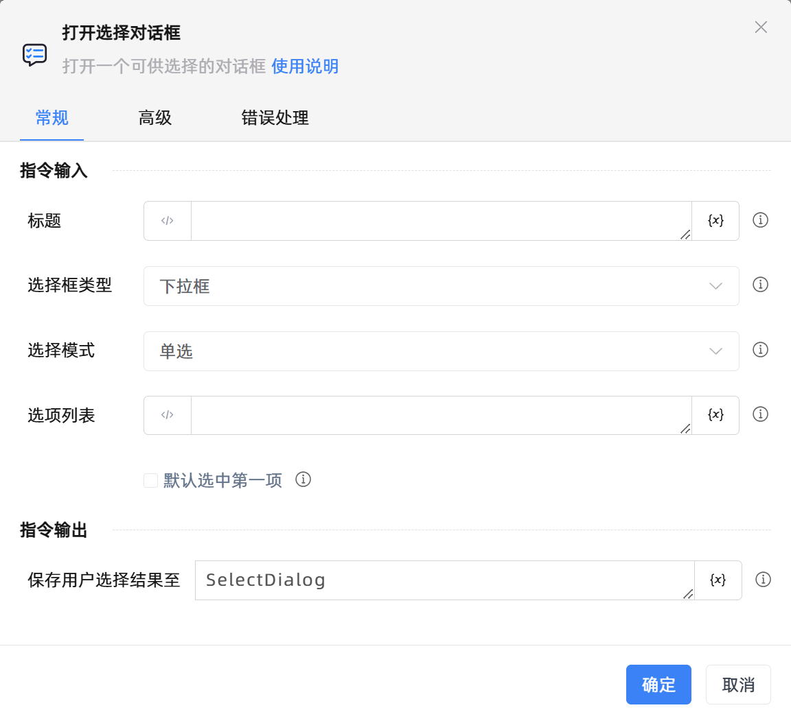

# 打开选择对话框
- 适用系统: windows / 信创

## 功能说明

:::tip 功能描述
打开一个可供选择的对话框
:::

## 配置项说明

### 指令输入

- **标题**`string`: 
  - 请输入对话框标题

- **选择框类型**`Integer`: 
  - 请指定选择框类型

- **选择模式**`Integer`: 
  - 请指定选择模式

- **选项列表**`TList<string>`: 
  - 选项列表，每一行表示一个选项，多个选项用,隔开

- **默认选中第一项**`Boolean`: 
  - 默认会选中首项

- **说明**`string`: 
  - 请输入对话框说明

- **超时的时间(毫秒)**`string`: 
  - 通知信息的展示时长，默认为30000毫秒

### 指令输出

- **保存用户选择结果至**`string`: 
  - 指定一个变量名称，该变量用于保存用户选择结果，若用户取消对话框，则返回 None，若未取消则返回 dict 对象

### 使用示例

- [点击下载查看示例](https://files.oss.krpalite.com:56780/%E5%BA%94%E7%94%A8/%E7%A4%BA%E4%BE%8B_%E6%89%93%E5%BC%80%E9%80%89%E6%8B%A9%E5%AF%B9%E8%AF%9D%E6%A1%86.krpa) 
