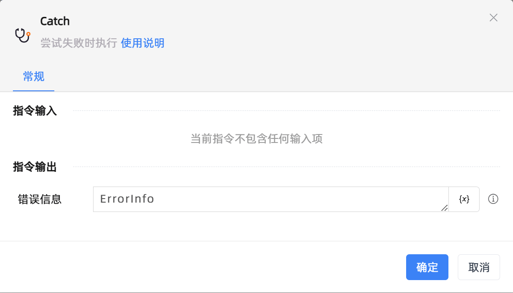

# Catch

## 功能说明

:::tip 功能描述
尝试失败时执行
:::

## 配置项说明

### 常规

**指令输入**

当前指令无输入

**指令输出**

- **错误信息**`string`: 输入一个名称作为保存错误信息的变量，当指令执行出错的时候错误信息将会保存至此变量中

## 使用示例

**流程逻辑描述：** 

## 常见错误及处理

无

## 常见问题解答

无

