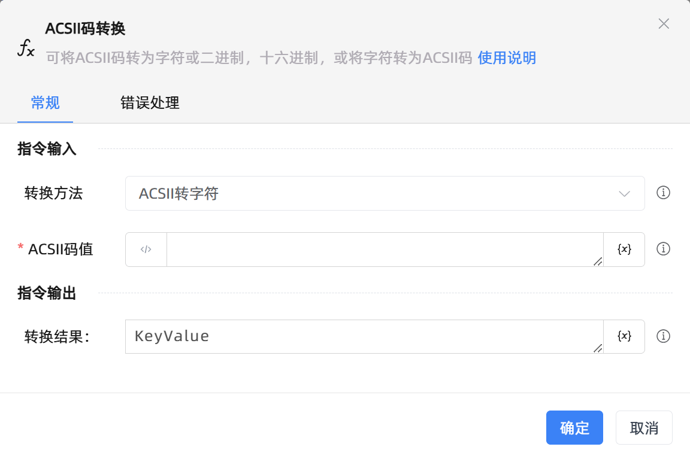

# ACSII码转换

## 功能说明

:::tip 功能描述
可将ACSII码转为字符或二进制，十六进制，或将字符转为ACSII码
:::

## 配置项说明

### 常规

**指令输入**

- **转换方法**`Integer`: 选择ACSII转换方法

- **ACSII码值**`Integer`: 输入0到255的ACSII键值

- **字符值**`string`: 输入需要转换为ACSII的值

**指令输出**

- **转换结果：**`string`: 通过ACSII码转换输出结果

### 错误处理

- **打印错误日志**`Boolean`：当指令运行出错时，打印错误日志到【日志】面板。默认勾选。

- **处理方式**`Integer`：

 - **终止流程**：指令运行出错时，终止流程。

 - **忽略异常并继续执行**：指令运行出错时，忽略异常，继续执行流程。

 - **重试此指令**：指令运行出错时，重试运行指定次数指令，每次重试间隔指定时长。

## 使用示例
无

## 常见错误及处理

无

## 常见问题解答

无

