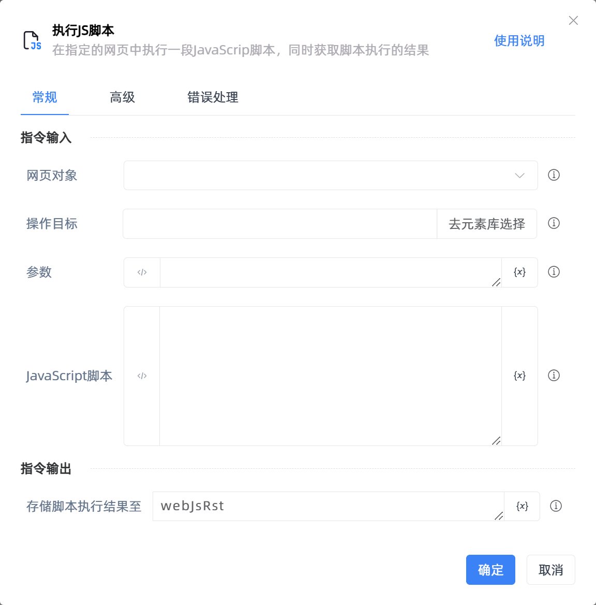

# 执行JS脚本

## 功能说明

:::tip 功能描述
在指定的网页中执行一段JavaScrip脚本，并获取脚本执行结果
:::

## 配置项说明

### 常规

**指令输入**

- **网页对象**`TBrowser`: 输入一个获取到的或通过'打开网页'函数创建的网页对象

- **目标元素**`TTarget`: 请选择需要操作的目标网页元素

- **参数**`string`: 要传入到JavaScrip脚本中的参数

- **JavaScript脚本**`string`: 编写用于执行的 JavaScript 脚本

**指令输出**

- **存储脚本执行结果至**`string`: 指定一个变量用于存储脚本执行结果

### 高级

- **等待目标元素存在(毫秒)**`Integer`: 等待元素存在的超时时间

- **执行环境**`Integer`: 指定Js脚本的目标执行环境

- **执行前的延迟(毫秒)**`Integer`: 指令执行前的等待时间

### 错误处理

- **打印错误日志**`Boolean`：当指令运行出错时，打印错误日志到【日志】面板。默认勾选。

- **处理方式**`Integer`：

 - **终止流程**：指令运行出错时，终止流程。

 - **忽略异常并继续执行**：指令运行出错时，忽略异常，继续执行流程。

 - **重试此指令**：指令运行出错时，重试运行指定次数指令，每次重试间隔指定时长。

## 使用示例

**流程逻辑描述：** 

## 常见错误及处理

无

## 常见问题解答

无

