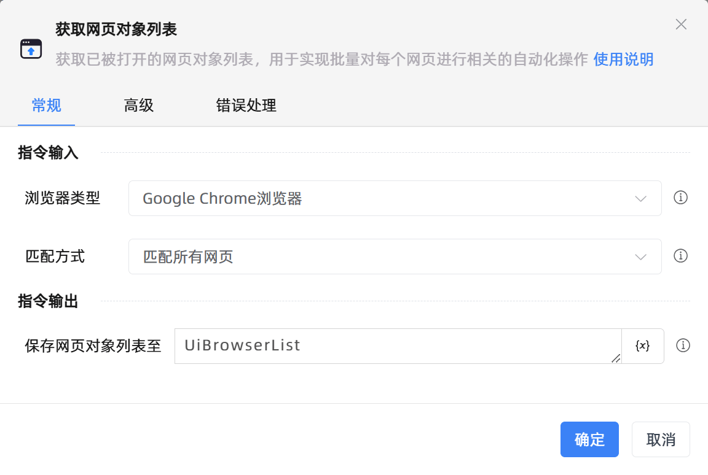

# 获取网页对象列表

## 功能说明

:::tip 功能描述
获取已被打开的网页对象列表，用于实现批量对每个网页进行相关的自动化操作
:::

## 配置项说明

### 常规

**指令输入**

- **浏览器类型**`Integer`: 选择浏览器类型，需至[设置]-[插件中心]安装对应的浏览器插件才能实现自动化

- **匹配方式**`Integer`: 请输入选择需要以哪种方式匹配网页

- **标题**`string`: 请输入需要匹配的网页标题，支持使用模糊匹配

- **网址**`string`: 请输入需要打开的网页地址

- **启用通配符匹配**`Boolean`: 决定是否启用通配符匹配，这将决定常见通配符是被视为普通字符还是通配符

**指令输出**

- **保存网页对象列表至**`TList<TUiElement>`: 该变量保存的是网页对象列表，使用此网页对象可以对网页进行自动化操作

### 高级

- **执行前的延迟(毫秒)**`Integer`: 指令执行前的等待时间

### 错误处理

- **打印错误日志**`Boolean`：当指令运行出错时，打印错误日志到【日志】面板。默认勾选。

- **处理方式**`Integer`：

 - **终止流程**：指令运行出错时，终止流程。

 - **忽略异常并继续执行**：指令运行出错时，忽略异常，继续执行流程。

 - **重试此指令**：指令运行出错时，重试运行指定次数指令，每次重试间隔指定时长。

## 使用示例

**流程逻辑描述：** 

## 常见错误及处理

无

## 常见问题解答

无

