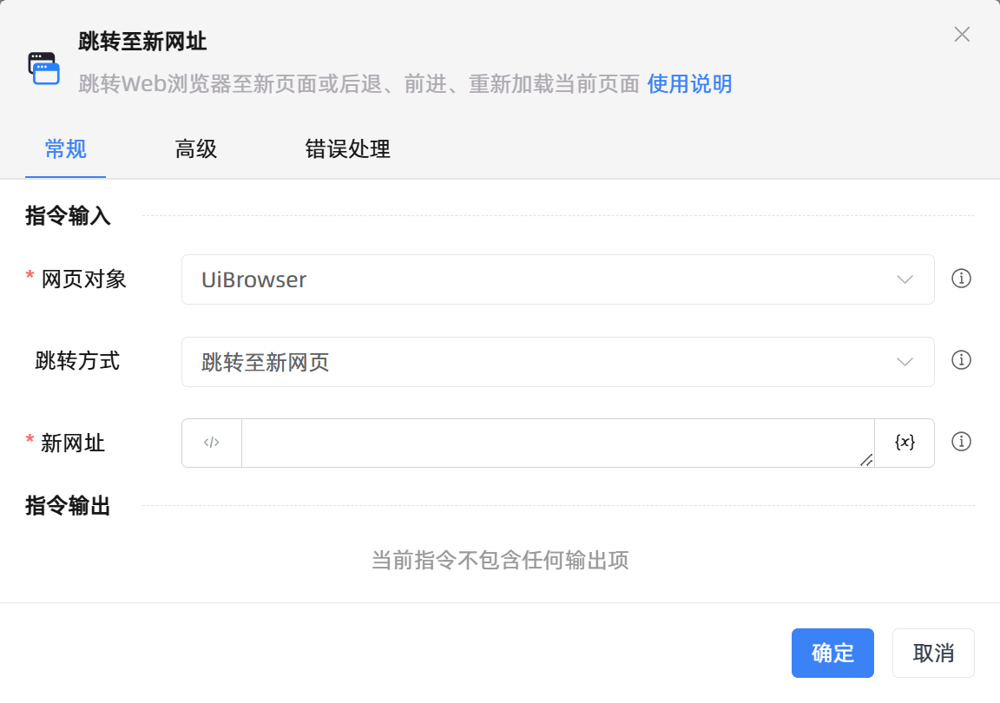

# 跳转至新网址

## 功能说明

:::tip 功能描述
跳转Web浏览器至新页面或后退、前进、重新加载当前页面
:::

## 指令输入

- **网页对象**`TBrowser`: 
    - 输入一个获取到的或通过'打开网页'函数创建的网页对象

- **跳转方式**`Integer`: 
    - 网页的跳转方式。包括跳转至新网页、后退、前进、重新加载(刷新)

- **新网址**`string`: 
    - 目标跳转网址

### 高级

- **网页加载超时的时间（毫秒）**`Integer`: 
    - 加载完成的超时时间（毫秒）

- **执行前的延迟(毫秒)**`Integer`: 
    - 指令执行前的等待时间（毫秒）

## 使用示例

**流程逻辑描述：** 使用【打开网页】指令打开金智维官网 --> 使用【跳转至新网址】指令跳转至新网页 --> 再次使用【跳转至新网址】指令后退回到金智维官网页面

