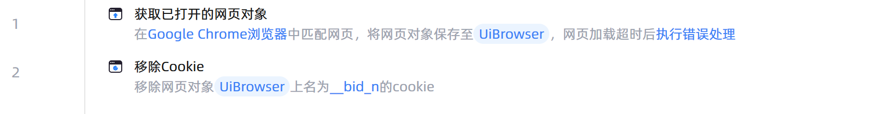

# 移除Cookie

## 功能说明

:::tip 功能描述
将通过Cookie url、Cookie name指定的Cookie移除
:::

## 配置项说明

### 常规

**指令输入**

- **Url设置方式**`Integer`: Cookie Url 的设置来源，也可选择手动输入，若选择网页对象，则自动使用该网页对象的 Url

- **网页对象**`TBrowser`: 输入一个获取到的或通过'打开网页'函数创建的网页对象

- **浏览器类型**`Integer`: 设置指定类型浏览器Cookie

- **Cookie Url**`string`: Cookie Url，将要被移除的Cookie Url

- **移除方式**`Integer`: 选择移除指定Cookie或移除所有Cookie

- **Cookie Name**`string`: 将要被移除的Cookie名称

**指令输出**

当前指令无输出

### 高级

- **执行前的延迟(毫秒)**`Integer`: 指令执行前的等待时间（毫秒）

### 错误处理

- **打印错误日志**`Boolean`：当指令运行出错时，打印错误日志到【日志】面板。默认勾选。

- **处理方式**`Integer`：

 - **终止流程**：指令运行出错时，终止流程。

 - **忽略异常并继续执行**：指令运行出错时，忽略异常，继续执行流程。

 - **重试此指令**：指令运行出错时，重试运行指定次数指令，每次重试间隔指定时长。

## 使用示例

**流程逻辑描述：** 使用【获取以打开的网页对象】指令获取已经打开的网页对象 --> 使用【移除Cookie】指令移除指定的Cookie

## 常见错误及处理

无

## 常见问题解答

无

