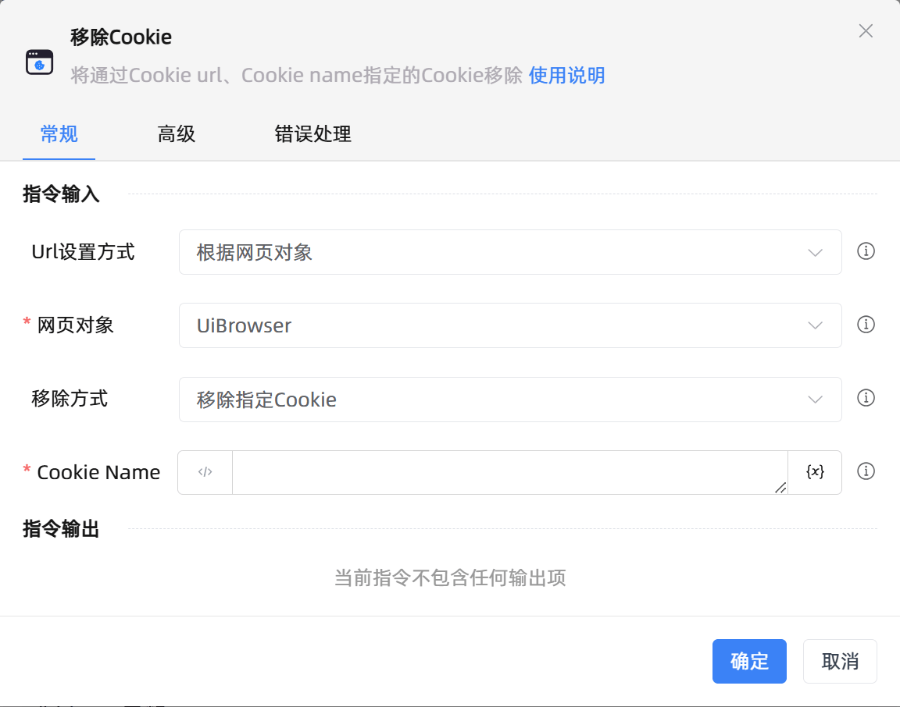

# 移除Cookie
- 适用系统: windows / 信创

## 功能说明

:::tip 功能描述
将通过Cookie url、Cookie name指定的Cookie移除
:::

## 指令输入

- **Url设置方式**`Integer`: 
    - Cookie Url 的设置来源，也可选择手动输入，若选择网页对象，则自动使用该网页对象的 Url

- **网页对象**`TBrowser`: 
    - 输入一个获取到的或通过'打开网页'函数创建的网页对象

- **浏览器类型**`Integer`: 
    - 设置指定类型浏览器Cookie

- **Cookie Url**`string`: 
    - Cookie Url，将要被移除的Cookie Url

- **移除方式**`Integer`: 
    - 选择移除指定Cookie或移除所有Cookie

- **Cookie Name**`string`: 
    - 将要被移除的Cookie名称

### 高级

- **执行前的延迟(毫秒)**`Integer`: 
    - 指令执行前的等待时间（毫秒）

## 使用示例

**流程逻辑描述：** 使用【获取以打开的网页对象】指令获取已经打开的网页对象 --> 使用【移除Cookie】指令移除指定的Cookie
