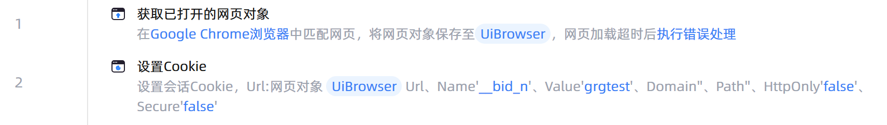

# 设置Cookie

## 功能说明

:::tip 功能描述
根据指定的 Cookie 数据设置 Cookie，如果存在相同的 Cookie，则覆盖
:::

## 指令输入

- **Url设置方式**`Integer`: 
    - 设置Cookie的Url，可选择手动输入，也可选择网页对象。如果使用网页对象，则自动使用该网页对象的 Url

- **网页对象**`TBrowser`: 
    - 输入一个获取到的或通过'打开网页'函数创建的网页对象

- **浏览器类型**`Integer`: 
    - 设置指定类型浏览器Cookie

- **Cookie Url**`string`: 
    - Cookie Url 是与 Cookie 相关联的 Url，该值会影响创建 Cookie 的默认 Domain 和 Path

- **Cookie Name**`string`: 
    - CookieName，若忽略则为空

- **Cookie Value**`string`: 
    - CookieValue，若忽略则为空

- **Cookie Domain**`string`: 
    - Url 的 Domain 部分，如果忽略，则该 Cookie 为 host-only Cookie

- **Cookie Path**`string`: 
    - Cookie Path 默认为 Url 的 path 部分，若忽略，则为空

- **HttpOnly**`Boolean`: 
    - 设置 Cookie 是否标记为 HttpOnly，默认值为 False

- **Secure**`Boolean`: 
    - 设置 Cookie 是否被标记为 Secure，默认值为False

- **设置为会话 Cookie**`Boolean`: 
    - 默认情况下，设置为会话 Cookie，取消勾选则设置为持久化 Cookie

- **Cookie 有效时间(秒)**`Integer`: 
    - 持久化 Cookie 需要设置有效期（即 Cookie 生效到失效的时间间隔，单位为秒），默认有效期为 100 秒

### 高级

- **执行前的延迟(毫秒)**`Integer`: 
    - 指令执行前的等待时间

## 使用示例

**流程逻辑描述：** 使用【获取以打开的网页对象】指令获取已经打开的网页对象 --> 使用【设置Cookie】指令设置指定的Cookie值

