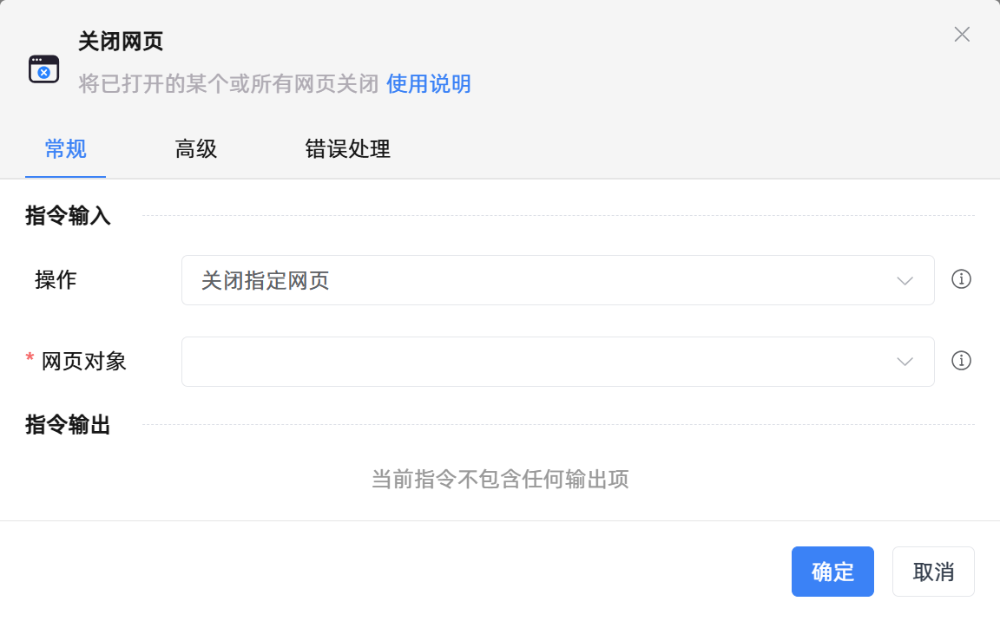

# 关闭网页

## 功能说明

:::tip 功能描述
将已打开的某个或所有网页关闭
:::

## 指令输入

- **操作**`Integer`: 
    - 指定关闭一个指定的网页或关闭所有网页

 

- **操作浏览器**`Integer`: 
    - 选择需要操作的浏览器对象

 

- **终止浏览器进程**`Boolean`: 
    - 若选择此选项，属于当前用户的指定浏览器进程和由它启动的所有子进程将被强制结束

 

- **网页对象**`TBrowser`: 
    - 输入一个获取到的或通过'打开网页'函数创建的网页对象

### 高级

- **执行前的延迟(毫秒)**`Integer`: 
    - 指令执行前的等待时间

## 使用示例

**流程逻辑描述：** 使用【打开网页】指令打开百度知道 --> 使用【获取元素信息(web)】指令获取指定元素的文本内容 --> 使用【打印日志】指令打印输出获取到的元素文本内容 --> 使用【关闭网页】指令关闭网页

