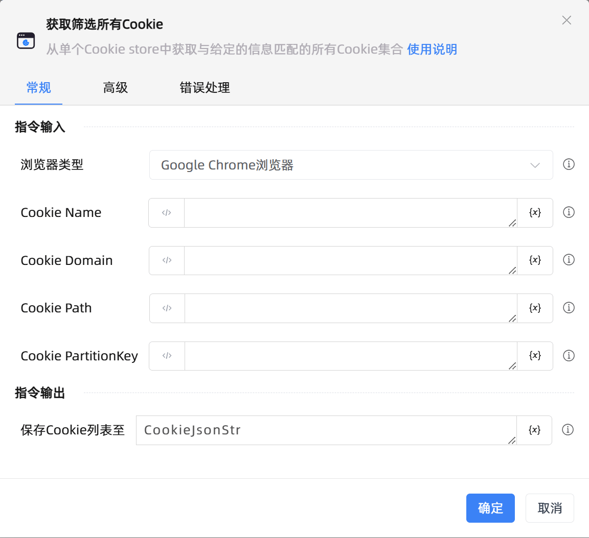

# 获取筛选所有Cookie

## 功能说明

:::tip 功能描述
从单个Cookie store中获取与给定信息匹配的所有Cookie集合
:::

## 配置项说明

### 常规

**指令输入**

- **浏览器类型**`Integer`: 获取指定类型浏览器Cookie

- **Cookie Url**`string`: 根据给定的Url筛选Cookie，为空则忽略Url筛选条件

- **Cookie Name**`string`: 根据给定的Name筛选Cookie，为空则忽略Name筛选条件

- **Cookie Domain**`string`: 默认为Url的Domain部分，忽略则该Cookie为host-only Cookie

- **Cookie Path**`string`: 默认为Url的Path部分，为空则忽略Path筛选条件

- **Cookie PartitionKey**`string`: 根据给定的PartitionKey筛选Cookie，为空则忽略PartitionKey筛选条件

**指令输出**

- **保存Cookie列表至**`string`: 保存获取到的Cookie列表

### 高级

- **根据Cookie Secure属性筛选**`Boolean`: 筛选 secure=true 的Cookie或 secure=fasle 的Cookie

- **仅Secure Cookie**`Boolean`: 设置Cookie是否被标记为HttpOnly，默认False

- **根据Cookie 生命周期筛选**`Boolean`: 默认设置会话Cookie，取消勾选则设置持久化Cookie

- **仅会话Cookie**`Boolean`: 筛选会话cookie集合

- **执行前延迟(毫秒)**`Integer`: 指令执行前等待的时间

### 错误处理

- **打印错误日志**`Boolean`：当指令运行出错时，打印错误日志到【日志】面板。默认勾选。

- **处理方式**`Integer`：

 - **终止流程**：指令运行出错时，终止流程。

 - **忽略异常并继续执行**：指令运行出错时，忽略异常，继续执行流程。

 - **重试此指令**：指令运行出错时，重试运行指定次数指令，每次重试间隔指定时长。

## 使用示例

**流程逻辑描述：** 

## 常见错误及处理

无

## 常见问题解答

无

