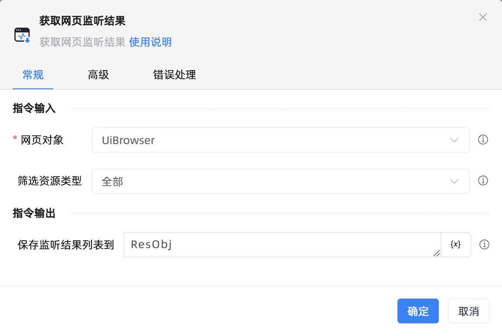

# 获取网页监听结果

## 功能说明

:::tip 功能描述
获取网页监听结果
:::

## 配置项说明

### 常规

**指令输入**

- **网页对象**`TBrowser`: 输入一个获取到的或通过'打开网页'函数创建的网页对象

- **筛选资源类型**`Integer`: 获取网页监听的资源类型

**指令输出**

- **保存监听结果列表到**`string`: 指定一个列表变量，用于保存获取到的网页监听结果列表

### 高级

- **执行前的延迟(毫秒)**`Integer`: 指令执行前的等待时间

### 错误处理

- **打印错误日志**`Boolean`：当指令运行出错时，打印错误日志到【日志】面板。默认勾选。

- **处理方式**`Integer`：

 - **终止流程**：指令运行出错时，终止流程。

 - **忽略异常并继续执行**：指令运行出错时，忽略异常，继续执行流程。

 - **重试此指令**：指令运行出错时，重试运行指定次数指令，每次重试间隔指定时长。

## 使用示例

**流程逻辑描述：** 

## 常见错误及处理

无

## 常见问题解答

无

