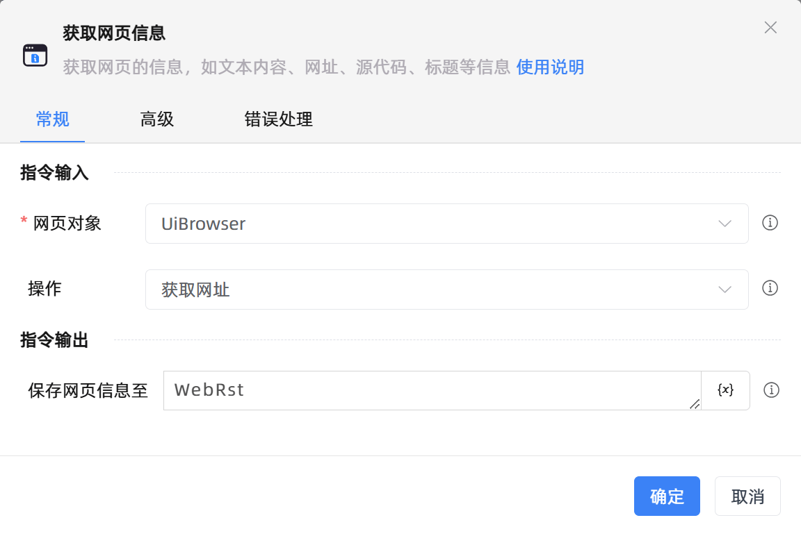

# 获取网页信息

## 功能说明

:::tip 功能描述
获取网页的信息，如文本内容、网址、源代码、标题等信息
:::

## 配置项说明

### 常规

**指令输入**

- **网页对象**`TBrowser`: 输入一个获取到的或通过'打开网页'函数创建的网页对象

- **操作**`Integer`: 请选择要获取的网页信息。包括：

    - **获取网址**：获取网页的网址

    - **获取网页标题**：获取网页的标题

    - **获取网页源代码**：获取网页的源代码

    - **获取网页文本内容**：获取网页的全部可见文本内容

**指令输出**

- **保存网页信息至**`string`: 指定一个变量名称，用于保存获取到的网页信息

### 高级

- **执行前的延迟(毫秒)**`Integer`: 指令执行前的等待时间

### 错误处理

- **打印错误日志**`Boolean`：当指令运行出错时，打印错误日志到【日志】面板。默认勾选。

- **处理方式**`Integer`：

    - **终止流程**：指令运行出错时，终止流程。

    - **忽略异常并继续执行**：指令运行出错时，忽略异常，继续执行流程。

    - **重试此指令**：指令运行出错时，重试运行指定次数指令，每次重试间隔指定时长。

## 使用示例

**流程逻辑描述：** 使用【获取已打开的网页对象】指令获取目标网页对象 --> 使用【获取网页信息】指令获取依次获取网页的网址、标题、源代码、可见文本内容 --> 运行【打印日志】指令将网页信息依次打印输出

## 常见错误及处理

无

## 常见问题解答

无

