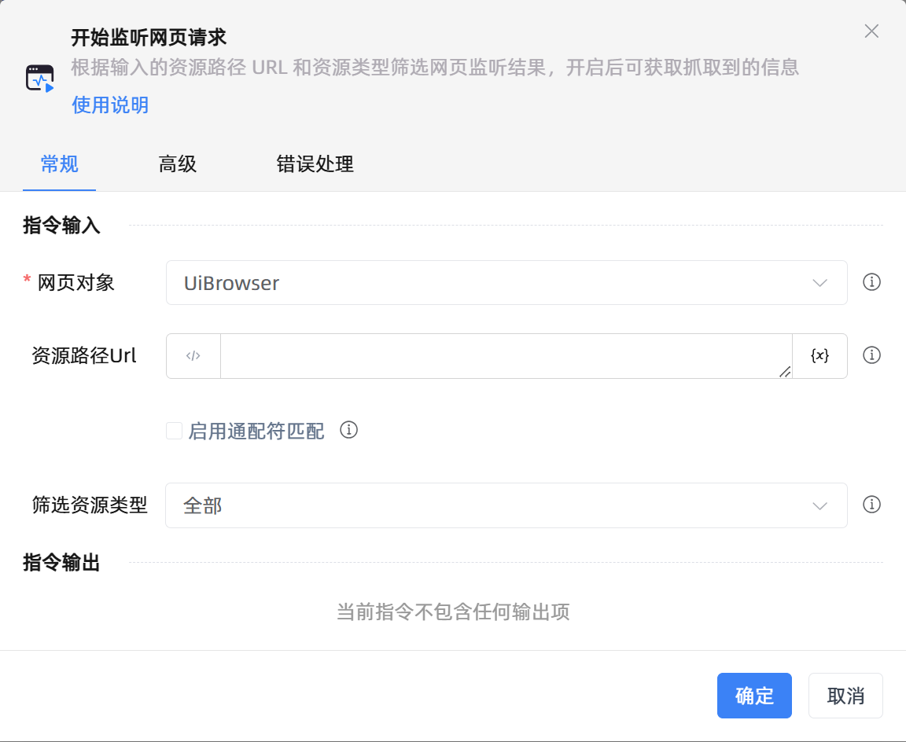

# 开始监听网页请求
- 适用系统: windows / 信创

## 功能说明

:::tip 功能描述
根据输入的资源路径 URL 和资源类型筛选网页监听结果，开启后可获取抓取到的信息
:::

## 配置项说明

### 常规

**指令输入**

- **网页对象**`TBrowser`: 输入一个获取到的或通过'打开网页'函数创建的网页对象

- **资源路径Url**`string`: 可以根据输入的资源筛选网页的监听结果

- **启用通配符匹配**`Boolean`: 决定是否启用通配符匹配来筛选Url，这将决定常见通配符是被视为普通字符还是通配符

- **筛选资源类型**`Integer`: 获取网页监听的类型

**指令输出**

当前指令无输出

### 高级

- **执行前的延迟(毫秒)**`Integer`: 指令执行前的等待时间

### 错误处理

- **打印错误日志**`Boolean`：当指令运行出错时，打印错误日志到【日志】面板。默认勾选。

- **处理方式**`Integer`：

 - **终止流程**：指令运行出错时，终止流程。

 - **忽略异常并继续执行**：指令运行出错时，忽略异常，继续执行流程。

 - **重试此指令**：指令运行出错时，重试运行指定次数指令，每次重试间隔指定时长。

## 使用示例
无

## 常见错误及处理

无

## 常见问题解答

无

