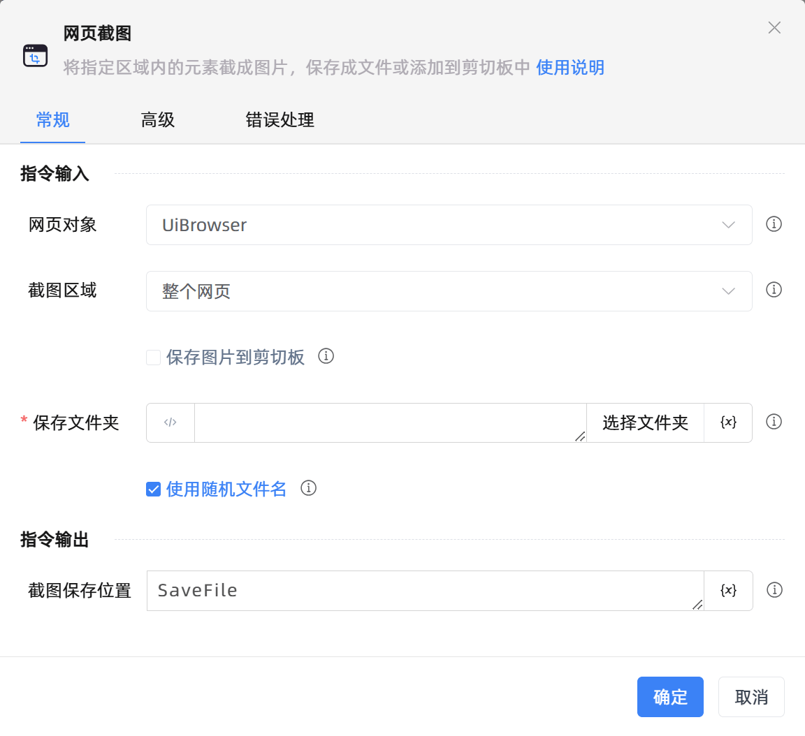

# 网页截图
- 适用系统: windows / 信创

## 功能说明

:::tip 功能描述
将指定区域内的元素截成图片，保存成文件或添加到剪切板中
:::

## 配置项说明

### 常规

**指令输入**

- **网页对象**`TBrowser`: 输入一个获取到的或通过'打开网页'函数创建的网页对象

- **截图区域**`Integer`: 请选择截图的区域。

    - **网页元素**：截取操作目标图片

    - **网页可见区域**：截取当前网页中可见区域的内容

    - **整个网页**：整个网页有滚动条的情况，会截图滚动条长度内的所有内容

- **操作目标**`TTarget`: 选择需要操作的网页元素。可以从「元素库」中选择一个已捕获的元素，或使用「捕获新元素」功能来获取网页中的新元素作为操作目标。

- **保存图片到剪切板**`Boolean`: 保存图片到剪切板。支持后续流程通过CTRL+V操作将图片进行粘贴

- **保存文件夹**`string`: 用于保存截图的文件夹，若留空，截图将保存在KRPA Lite.exe的同级目录下

- **使用随机文件名**`Boolean`: 可以自动生成不重复的文件名

- **自定义文件名**`string`: 自定义文件名

**指令输出**

- **截图保存位置**`string`: 指定一个变量，用于保存截图文件所在的位置

### 高级

- **执行前的延迟(毫秒)**`Integer`: 指令执行前的等待时间

- **等待目标元素存在(毫秒)**`Integer`: 指定时间内未找到目标元素则执行错误处理逻辑

### 错误处理

- **打印错误日志**`Boolean`：当指令运行出错时，打印错误日志到【日志】面板。默认勾选。

- **处理方式**`Integer`：

    - **终止流程**：指令运行出错时，终止流程。

    - **忽略异常并继续执行**：指令运行出错时，忽略异常，继续执行流程。

    - **重试此指令**：指令运行出错时，重试运行指定次数指令，每次重试间隔指定时长。

## 使用示例

**流程逻辑描述：** 使用【打开网页】指令打开目标网址 --> 使用【网页截图】指令截取网页可见区域并保存到指定目录下

## 常见错误及处理

无

## 常见问题解答

无

