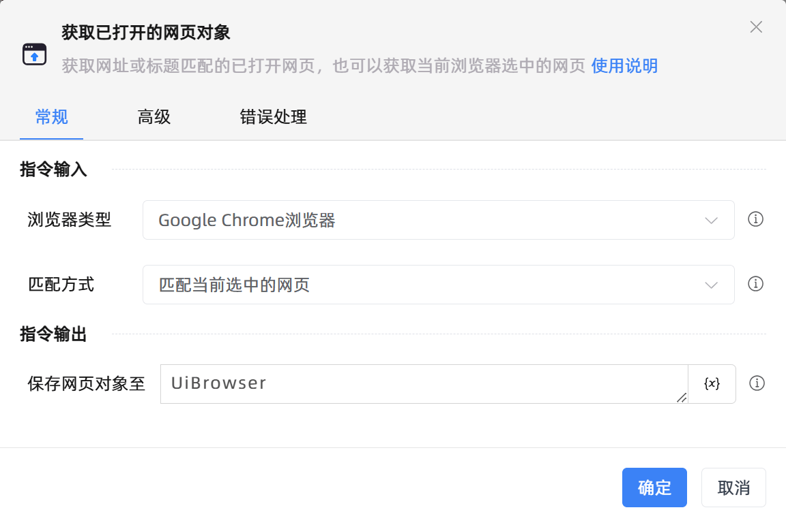

# 获取已打开的网页对象

## 功能说明

:::tip 功能描述
获取网址或标题匹配已打开的网页，或者获取当前浏览器选中的网页
:::

## 配置项说明

### 常规

**指令输入**

- **浏览器类型**`Integer`: 选择浏览器类型，需至[设置]-[插件中心]安装对应的浏览器插件才能实现自动化

- **匹配方式**`Integer`: 输入需要打开的网页地址

- **标题**`string`: 输入需要匹配的网页标题，支持模糊匹配

- **网址**`string`: 输入需要打开的网页地址

- **根据通配符匹配**`Boolean`: 根据通配符匹配

**指令输出**

- **保存网页对象至**`TBrowser`: 该变量保存的是网页对象，使用此网页对象可以对网页进行自动化操作

### 高级

- **等待网页加载完成**`Boolean`: 是否等待网页加载完成

- **加载超时时间（毫秒）**`Integer`: 等待页面加载超时的时间（毫秒）

- **加载超时后执行**`Integer`: 等待页面加载超时后希望执行的操作

- **匹配失败时打开新网页**`Boolean`: 根据网页标题或网址匹配失败时，打开新网页

- **新网址**`string`: 打开新网页的网址

- **执行前延迟(毫秒)**`Integer`: 指令执行前等待的时间

### 错误处理

- **打印错误日志**`Boolean`：当指令运行出错时，打印错误日志到【日志】面板。默认勾选。

- **处理方式**`Integer`：

 - **终止流程**：指令运行出错时，终止流程。

 - **忽略异常并继续执行**：指令运行出错时，忽略异常，继续执行流程。

 - **重试此指令**：指令运行出错时，重试运行指定次数指令，每次重试间隔指定时长。

## 使用示例

**流程逻辑描述：** 

## 常见错误及处理

无

## 常见问题解答

无

