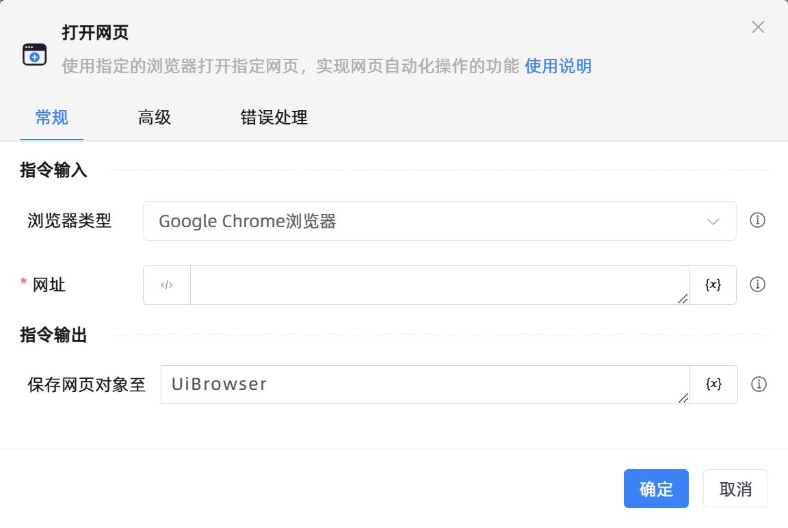

# 打开网页

## 功能说明

:::tip 功能描述
使用指定的浏览器打开指定网页，实现网页自动化操作的功能
:::

## 配置项说明

### 常规

**指令输入**

- **浏览器类型**`Integer`: 选择浏览器的类型，需至[设置]-[插件中心]安装对应的浏览器插件才能实现自动化。另外如果浏览器安装路径非默认系统盘，需要在高级选项中设置安装路径

- **网址**`string`: 请输入需要打开的网页链接

**指令输出**

- **保存网页对象至**`TBrowser`: 该变量存储网页对象，可通过该对象进行网页自动化操作

### 高级

- **等待网页加载完成**`Boolean`: 是否等待网页资源加载完毕

- **加载超时时间（毫秒）**`Integer`: 等待页面加载超时的时间（毫秒）

- **加载超时后执行**`Integer`: 当页面加载超时后希望执行的操作

- **浏览器安装路径**`string`: 默认使用系统盘安装路径，若安装的路径非默认，请选择对应浏览器的程序路径

- **命令行参数**`string`: 命令行参数，需要是浏览器支持的命令行，此选项可以留空

- **执行前的延迟(毫秒)**`Integer`: 指令执行前的等待时间

### 错误处理

- **打印错误日志**`Boolean`：当指令运行出错时，打印错误日志到【日志】面板。默认勾选。

- **处理方式**`Integer`：

 - **终止流程**：指令运行出错时，终止流程。

 - **忽略异常并继续执行**：指令运行出错时，忽略异常，继续执行流程。

 - **重试此指令**：指令运行出错时，重试运行指定次数指令，每次重试间隔指定时长。

## 使用示例

**流程逻辑描述：** 

## 常见错误及处理

无

## 常见问题解答

无

