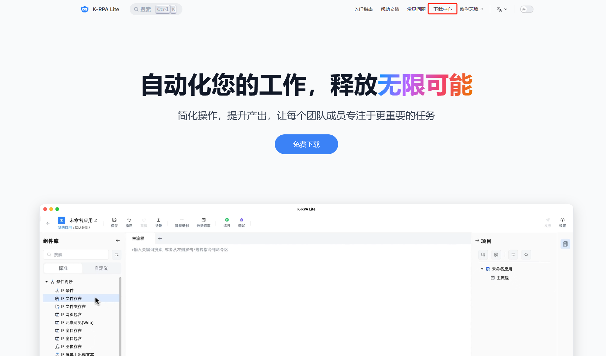
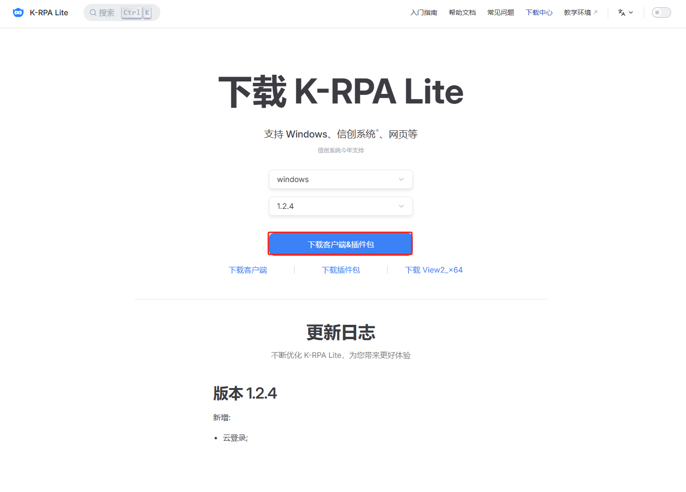
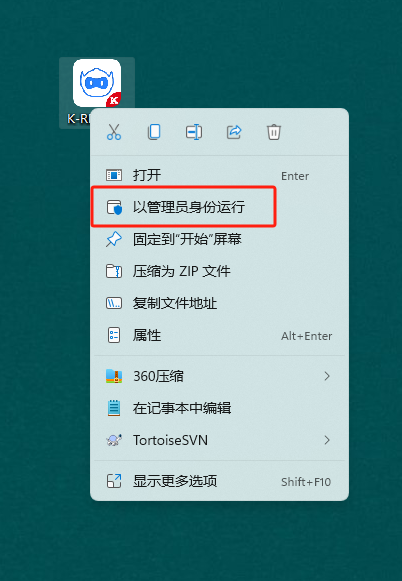
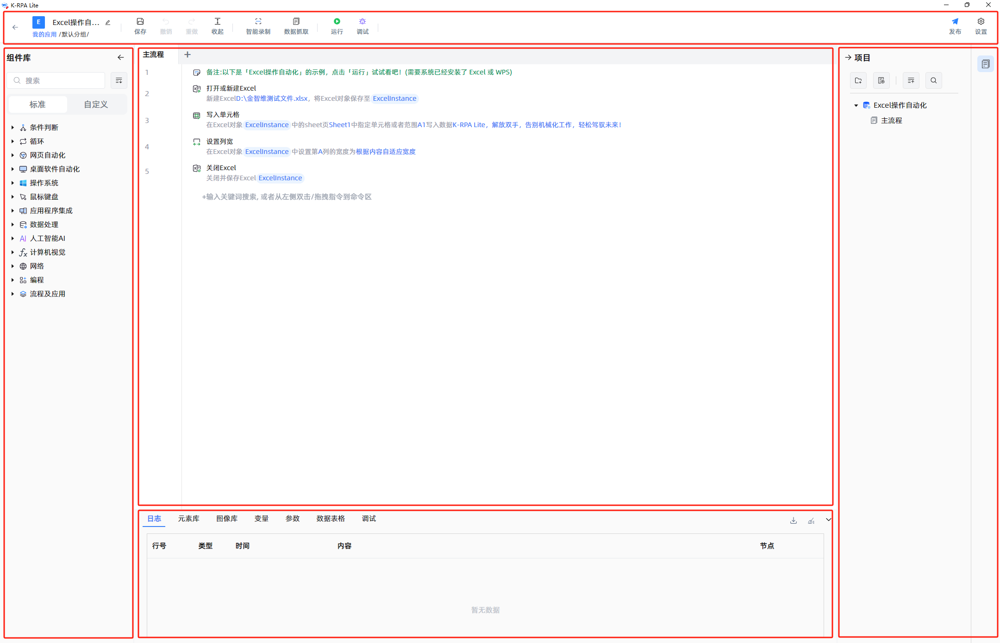
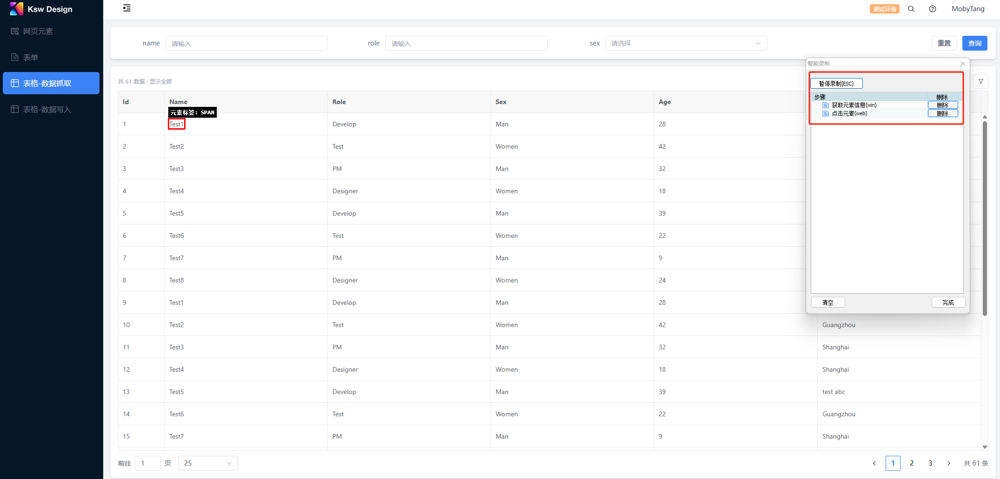
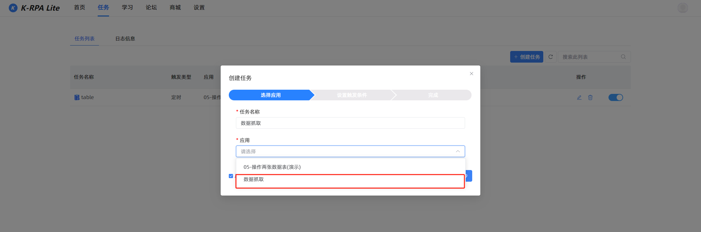

# 用户操作手册

**文档修订记录**

| **版本** | **修订说明**         | **日期**    | **版本号**    | **作者**  | **审核人** |
| ------ | ---------------- | --------- | ---------- | ------- | ------- |
| v1.0   | K-RPA Lite用户操作手册 |  20250114 | 1.0.5-beta |  陈浩罡/黄菊 |         |
| v.2.0  |                  |  20250418 | 1.2.5-beta |  陈浩罡/黄菊 |         |

## 一、产品概述

### 1.1 编写目的

编写本文档目的在于让使用本系统的用户能够快速熟悉K-RPA Lite系统的操作，能够熟练使用本系统。本手册的读者群体为系统的实际使用人员。

### 1.2 产品介绍

#### 1.2.1 什么是K-RPA Lite

K-RPA Lite是金智维推出的一款全新的低代码机器人流程自动化（RPA）设计平台，专为那些希望通过自动化提升工作效率、降低人工错误的用户设计。它打破了传统RPA工具复杂的学习曲线，凭借其直观的低代码界面，使得非技术人员也能快速创建、管理自动化流程。无论是业务用户、IT人员还是开发人员，K-RPA Lite都能帮助他们轻松实现业务流程的自动化。

#### 1.2.2 K-RPA与K-RPA Lite区别

K-RPA 定位大中型企业客户, 围绕着“专业、稳定、安全”的运行要求,  需要对开发和运维要求进行专业培训, 学习成本较高。随着"人人都是开发者"的兴起，我们推出 K-RPA Lite，采用"易学易用、智慧赋能"的设计理念，让个人用户无需专业背景也能快速上手，轻松实现自动化流程。

#### 1.2.3 产品架构图

### 1.3 产品服务说明

#### 1.3.1 名词解析

1. **场景:&#x20;**&#x573A;景来源于业务搭建流程需求，是指在特定环境下完成业务需求，能让业务顺畅的运行所需要的条件。在本文中场景是通过应用实现的。

2. **流程:&#x20;**&#x6307;为了实现特定场景的要求而组成的一系列连续且有规律的活动集合。这些活动按照先后顺序或者并列关系被连接起来。

3. **应用：**&#x4E00;个完整的自动化流程，帮助你完成一项工作，可能包含多个步骤。比如，批量发送邮件就是一个应用，它包括获取收件人列表、编写邮件、发送邮件等多个操作。

4. **指令集：**&#x4E00;组可以重复使用的操作集合。例如，文件操作指令集，包括“复制文件”、“删除文件”、“移动文件”等，这些操作可以在多个不同的应用中使用。

5. **任务：**&#x88AB;安排在特定时间由机器人执行的应用。

#### 1.3.2 功能支持项

| **操作范围** | **功能** | **功能说明**                                                | **是否支持** |
| -------- | ------ | ------------------------------------------------------- | -------- |
| 应用管理     | 创建应用   | 是否支持基础业务场景设计，如创建应用、创建指令集、创建分组、发布应用、导入/导出场景、编辑应用、运行应用等操作 | 支持       |
|          | 操作指引   | 是否支持用户基础操作向导                                            | 支持       |
|          | 应用运行   | 是否支持调试流程、检查流程、节点报错定位、查看运行日志、设置流程断点等                     | 支持       |
|          | 经典案例   | 是否支持日常自动化案例使用，包括文本文件、Excel操作、抓取网页数据等                    | 支持       |
| 组件管理     | 组件库    | 是否支持场景化组件配置，包括条件判断、循环、网页自动化、桌面自动化、操作系统、鼠标键盘、应用程序集成等     | 支持       |
| 学习中心     | 知识库    | 是否支持部分课程应用案例教学，如网页自动化、Excel自动化等                         | 支持       |
| 设置管理     | 插件中心   | 是否支持插件安装，如Chrome、360、Edge、FireFox、PDF、图像、文本插件等          | 支持       |
|          | 常规项    | 是否支持程序自定义配置，如启动项、界面语言、快捷键、运行错误处理、版本升级等                  | 支持       |
| 触发器      | 任务触发   | 是否支持定时、邮件、文件任务触发，任务运行日志监控、异常报警等                         | 支持       |
| 自动化工具    | 数据抓取   | 是否支持网页、表格等数据批量抓取                                        | 支持       |
|          | 智能录制   | 是否支持人工操作录制                                              | 支持       |
|          | 元素库    | 是否支持标准模式、深度模式、元素编辑器、校验元素等操作                             | 支持       |
|          | 图像库    | 是否支持图像抓取、导入本地图像、图像编辑等操作                                 | 支持       |
|          | 参数     | 是否支持参数配置                                                | 支持       |
|          | 变量     | 是否支持变量配置                                                | 支持       |

#### 1.2.4 业务流程

1. 创建一个应用：在首页页签，找到【创建应用】按钮并单击它以启动新应用或指令集的创建过程:

2. 运行一个应用：完成工作流设计后，对其进行实际运行与测试验证;

3. 保存一个应用：对已调试完成的应用，单击【保存】保存按钮；

4. 发布一个应用：单击【发布】按钮，对应用进行正式发布；

5. 创建一个任务：在任务页签，找到【创建任务】按钮并单击它以启动新应用或指令集的创建过程:

## 二、快速入门

### 2.1 环境与登录

#### 2.1.1 安装程序

1. 环境要求

| **类型** | **说明**                                                                       |
| ------ | ---------------------------------------------------------------------------- |
| 操作系统   | Windows/Windowsxp/2003/2008/2012/2016/7/8/10等微软认证操作系统；                       |
| 硬件环境   | 硬盘大小 10GB 或以上 CPU  2 GHz 32 bit 或以上 内存 2GB 或以上 操作系统：Windows 7/ 10、linux、unix |
| 特性说明   | 绿色安装，自动升级，对宿主机CPU/内存影响低于2%；                                                  |
| 网络要求   | 网络传输流量很低，一个客户端连接传输不超过1kByte，对网络要求较低，大于512K网络即可满足；                            |
| 硬件配置   | 4C，8G内存，10G硬盘空间；                                                             |

* 安装过程（若您已下载设计器，可忽略此步骤）

- 安装说明：K-RPA LiteV1.2.5版仅支持社区版，通过简单的解压缩即可完成系统的安装。目前不支持Sever端接入。系统是绿色安全的软件，不会进行注册表的读写。无需担心系统对原系统的影响。

- **步骤一：下载流程设计器**

访问[K-RPA Lite官网](https://www.kingsware.cn/krpalite/)，点击右上角【下载中心】按钮，页面跳转后，点击【下载客户端&插件包】；

| **下载项**      | **下载项说明**                                                                           |
| ------------ | ----------------------------------------------------------------------------------- |
| 下载客户端&插件安装包  | 下载完整的应用程序安装包，包括客户端&流程自动化所需插件（如Chrome、Edge等浏览器插件）                                    |
| 下载客户端        | 仅下载K-RPA Lite应用程序，不包括流程自动化所需插件（如Chrome、Edge等浏览器插件）                                  |
| 下载插件包        | 仅下载流程自动化所需插件（如Chrome、Edge等浏览器插件），不包括K-RPA Lite应用程序                                  |
| 下载View2\_x64 | 一般情况下windows操作系统中均会自带该环境，用于在桌面应用程序中嵌入网页内容，无Webview2环境将无法在windows操作系统中正常运行K-RPA Lite |

* **步骤二：解压/安装目录**

双击【安装包】，在解压向导中安装指定目标文件夹（建议使用默认路径或自定义至合法目录，如 C:\Program Files\\<软件名>）；

* **步骤三：运行程序**

首次登录建议以管理员权限运行此程序，以确保对系统注册表具有完整的读写访问权限，单击文件内程序快捷方式或桌面程序图标，选择【管理员身份运行】；

#### 2.1.2 产品试用

用户场景：为用户提供产品试用流程指引，帮助用户快速开始使用产品。同时提供必要的名词解释帮助用户理解试用产品的规格等。

| **服务类型** | **服务说明**                              |
| -------- | ------------------------------------- |
| 登录方式     | 我们为您提供两种登录方式注：免费使用/云账号登录使用获得的产品体验是一致的 |

##### 2.1.2.1 选择登录方式 &#x20;

###### 2.1.2.1.1  登录方式一：云账号

1. **步骤一：注册云账号**

在云账号登录界面，单击下方【立即注册】。注意：目前暂不支持企业账号注册；

* **步骤二：完成云账号注册**

输入需要绑定的手机号和登录密码，单击【获取验证码】，在弹窗中填写手机短信验证码；

2. **步骤三：登录程序**

* 注册后，在登录页输入绑定的手机号和登录密码，点击【登录】即可登录程序；

* 勾选【记住登录状态】在下次重新登录程序时，无需再输入关联手机号和登录密码；

* 用户首次登录获得1个月产品试用权益，当试用期过后，需重新激活机器授权码；

###### 2.1.2.1.2 登录方式二：免费试用

1. **步骤一：免费试用**

登录K-RPA Lite程序，在云账号登录界面，单击下方【免费试用】；

* **步骤二：获取机器授权码**

单击【申请试用】添加企业管理员账号，获取授权码；

* **步骤三：激活产品试用权限**

在机器码授权验证界面，填写机器授权码信息，单击【激活】即可登录程序；

##### 2.1.2.2  如何继续试用产品

用户场景：每个账号都有1个月试用期限，当您完成首次登录，系统会自动记录您的机器码授权时间。您可以在控制台-->【设置】-->【个人信息】-->【机器码】查询。

1. **步骤一：申请试用**

当您的试用期结束后，再次登录云服务平台时，系统将自动跳转至机器码授权验证界面。如需继续使用，请点击【申请试用】按钮，系统将自动显示企业管理员联络信息，以便您完成正式授权申请流程。

* **步骤二：重新激活授权码**

在机器码授权验证界面，填写机器授权码信息，单击【激活】即可重新登录程序。

##### 2.1.2.4 如何找回密码

若您在登录时，忘记账号和密码，单击【忘记密码】可通过已绑定手机号重置登录密码。

#### 2.1.3 安装插件

* **步骤一：安装插件**

在流程设计器顶部Tab栏单击【设置】按钮后选择【插件中心】即可安装所需插件；

* **步骤二：启用插件**

点击之后，程序将提示关闭浏览器进程，单击【确定】待安装完成后点击【去启用】即可。

* **步骤三：检查插件是否安装成功**

以Google Chrome为例，您可以在浏览器的扩展程序中查看【KRPA Web Automation】插件是否处于打开的状态；

注意：开启开发者模式后可能需要退出浏览器重启后才能生效；

若浏览器插件未安装成功，单击【重新安装】即可完成安装；

### 2.2 界面功能模块概述

#### 2.2.1 界面入口说明

K-RPA Lite由6个部分构成：首页、任务、学习、论坛、商城、设置。

| **功能模块** | **功能描述**                                                      |
| -------- | ------------------------------------------------------------- |
| 首页       | 主要用于提供应用管理的主功能模块操作，用户可以通过功能快捷入口完成应用创建，指令集创建、应用发布、应用运行等操作      |
| 任务       | 主要用于定时、邮件、文件触发执行配置及任务运行日志管理，支持对运行失败、已取消、正在运行的任务进行查看日志、删除日志等操作 |
| 学习       | 主要提供在线课程学习，包括应用场景案例、基础操作等视频                                   |
| 论坛       | 主要用于开发者交流平台                                                   |
| 商城       | 金智维官方应用商城为用户提供丰富的场景化应用案例资源，支持在线下载与即装即用（使用前需完成云账号登录认证）         |
| 设置       | 主要用于自定义配置控制台常用功能、安装插件、查看程序版本信息、升级程序等                          |

#### 2.2.2 应用的基本概念

一个流程的搭建：在IDE界面，通过简单的拖拽组件，快速构建一个应用。

1. 多条指令按一定的逻辑排列，构成了一个自动化流程。

* 输入/输出：任意拖动一条指令，双击弹出指令窗口，对指令配置输入/输出项。

- 浏览器类型：下拉选择浏览器类型

- 网址：填写待打开地址

- 保存网页至对象：保存网页对象，后续流程可调用

* 错误处理：指令运行异常时的处理方式。

- 打印错误日志：打印流程运行时的错误日志

- 处理方式：下拉选择处理方式

#### 2.2.3 指令的基本概念

指令通常由5个要素构成，包括指令名称、指令功能说明、常规/高级属性(输入、输出)、属性说明、错误处理。

#### 2.2.4 首页

##### 2.2.4.1 最近打开项目

1. 用户场景：该页面主要提供快速创建应用、创建指令集、查看最近打开的应用等操作。

2. 操作步骤：最近打开项目-->单击【创建】-->选择【创建应用/创建指令集】-->进入IDE界面-->保存-->发布。

* 功能说明

| **功能名称** | **功能描述**                             |
| -------- | ------------------------------------ |
| 最近打开项目   | 通过页签切换，管理最近打开的应用及指令集                 |
| 创建应用     | 点击【创建】-【创建应用】即弹出新建应用窗口，支持快速创建应用      |
| 创建指令集    | 点击【创建】-【创建指令集】即弹出新建指令集窗口，支持快速创建指令集   |
| 运行       | 点击【运行】运行当前应用并弹出运行日志，指令集不支持运行预览       |
| 编辑       | 点击【编辑】跳转应用或指令集IDE界面                  |
| 删除       | 点击【删除】删除一条应用或指令集信息。应用或指令集正在运行时，不允许删除 |

##### 2.2.4.2 我的应用

1. 用户场景：用户登录流程设计器时，支持创建一个应用或应用分组。完成流程设计后，单击【发布】将应用进行正式发布。

2. 操作步骤：我的应用-->单击【创建】-->选择【创建应用】-->进入IDE界面-->保存-->发布。

* 功能说明

| **功能名称** | **功能描述**                     |
| -------- | ---------------------------- |
| 我的应用     | 通过页签切换，创建应用及应用管理             |
| 创建分组     | 点击【创建】-【创建分组】快速创建应用分组        |
| 创建应用     | 点击【创建】-【创建应用】快速创建应用          |
| 运行       | 点击【运行】运行当前应用并弹出运行日志          |
| 编辑       | 点击【编辑】跳转应用IDE界面              |
| 删除       | 点击【删除】删除一条应用信息。应用正在运行时，不允许删除 |

##### 2.2.4.3 我的指令集

1. 用户场景：用户登录流程设计器时，支持创建一个指令集或指令集分组。完成流程设计后，单击【发布】将指令集进行正式发布。在应用设计过程中，可通过”我的指令集“进行重复调用。

2. 操作步骤：我的指令集-->单击【创建】-->选择【创建指令集】-->进入IDE界面-->保存-->发布。

* 功能说明

| **功能名称** | **功能描述**                       |
| -------- | ------------------------------ |
| 我的指令集    | 通过页签切换，创建常用指令及指令管理             |
| 创建分组     | 点击【创建】-【创建分组】快速创建我的指令集分组       |
| 创建指令集    | 点击【创建】-【创建指令集】快速我的指令集          |
| 编辑       | 点击【编辑】跳转我的指令集IDE界面             |
| 删除       | 点击【删除】删除一条指令集信息。指令集正在调用时，不允许删除 |

##### 2.2.4.4 运行日志

1. 用户场景：用于查看【打印日志】指令的输出内容或运行调试结果。

2. 操作步骤：最近打开项目/我的应用-->单击【运行】-->在右下角“运行弹窗”查看运行结果。

* 功能说明

| **功能名称** | **功能描述**                           |
| -------- | ---------------------------------- |
| 运行       | 当应用状态为“编辑中”或“已发布”时，点击【运行】则弹出运行日志结果 |
| 查看       | 单击弹窗中的【日志】查看日志详情                   |
| 导出       | 以Txt的格式导出日志                        |

* 查看运行日志

#### 2.2.5 应用开发界面（IDE）

提供流程设计器的主功能模块操作、用户可从该页面执行指令设计、使用工具链等操作。

1. 顶部工具栏：快速访问智能录制、数据抓取、应用运行、调试、发布等操作；

2. 左侧组件库：提供已封装的组件；

3. 中间画布：通过拖住的方式完成流程搭建；

4. 下方工具栏：快速访问日志、元素库、图像库、参数、变量等操作；

5. 右上角工具栏：对项目进行管理，支持创建子流程及分组管理；

##### 2.2.5.1 顶部工具栏

| **功能** | **功能描述**                             |
| ------ | ------------------------------------ |
| 修改应用名称 | 修改应用名称，修改完成后，数据列表”名称“同步更新            |
| 保存应用   | 保存已编辑好的应用                            |
| 数据抓取   | 对网页、表格等进行数据抓取                        |
| 应用调试   | 可逐条运行并调试应用                           |
| 运行     | 预览流程运行，同步更新运行日志。当运行错误时，弹窗提示并自动定位错误指令 |
| 版本管理   | 对已编辑好的应用进行正式发布                       |

###### 2.2.5.1.1 批量数据抓取

用户场景：当抓取的对象为网页批量数据或规范表格时，可使用【批量数据抓取】

1. 步骤一：单击【数据抓取】

* 步骤二：在已打开的网页中，等待数据抓取编辑器弹出，单击【下一步】

* 步骤三：鼠标选择目标表单元素，**Ctrl+鼠标左键单击后会自动抓取当前表单全部数据信息**

* 步骤四：单击【确定】完成数据抓取

###### 2.2.5.1.2 智能录制

用户场景：智能录制功能通过自动识别用户的鼠标键盘操作并实时转换为K-RPA Lite组件，大幅简化流程搭建过程，有效降低开发门槛。

1. 步骤一：单击【录制】，进入录制状态

* 步骤二：单击【开始录制】或按下【F4】键即可启动K-RPA Lite录制功能，系统将自动记录您的所有点击、输入等操作并生成对应的动作列表。

* 步骤三：在智能录制模式下，当鼠标悬停超过0.1秒时，系统将弹出操作菜单，您可根据需求选择相应操作。

| **功能**   | **功能描述**                                             |
| -------- | ---------------------------------------------------- |
| 获取元素信息   | 提取元素显示的文本信息、当前页面的HTML源代码、读取元素的各类属性值（如id、class、href等） |
| 获取相似元素信息 | 获取一组相似元素的信息                                          |
| 输入       | 在输入框元素中填入指定内容                                        |
| 鼠标移动到这里  | 鼠标将自动悬停至目标位置或指定元素上方                                  |
| 点击       | 单击、双击及右键点击，可精准触发目标元素响应                               |
| 勾选       | 复选框元素可用，支持勾选、取消勾选和反选                                 |
| 选择下拉框    | 当操作下拉框元素时，将鼠标悬停在目标选项上即可完成选择                          |
| 点击并处理弹框  | 触发文件传输对话框时可自动处理上传/下载操作                               |
| 等待元素     | 等待指定元素出现或消失                                          |
| 截图       | 截图当前指定元素和保存                                          |

##### 2.2.5.2 左侧工具栏

提供已封装的组件。选中一个组件，将其拖拽至流程编排区，构建一个流程。

| **功能名称** | **功能描述**                                                            |
| -------- | ------------------------------------------------------------------- |
| 折叠       | 折叠组件库                                                               |
| 展开       | 展开所有组件                                                              |
| 检索       | 检索一个组件                                                              |
| 标准指令     | 组件包括条件判断、循环、网页自动化、桌面自动化、操作系统、系统键盘、应用程序集成、数据集成、AI人工智能AI、网络、编程、流程/应用。 |

##### 2.2.5.3 中间画布

| **功能名称** | **功能描述**                      |
| -------- | ----------------------------- |
| 创建子流程    | 点击【+】按钮，快速创建一个子流程，可被主流程或子流程调用 |
| 右键指令     |                               |

##### 2.2.5.4 下方工具栏

| **功能名称** | **功能描述**                                                                              |
| -------- | ------------------------------------------------------------------------------------- |
| 日志       | 展示当前运行日志及双击查看日志内容（日志内容来源：指令【打印日志】的输出内容或系统底层抛出的异常）                                     |
| 元素库      | 用于捕获、存放及展示网页元素，元素库中存放web元素 和win元素，可分别通过【网页自动化】和【软件自动化】指令集对对应的元素进行操作。目前支持标准模式捕获和深度模式捕获 |
| 图像库      | 用于捕获、操作图像元素，图像库中的图像可通过【鼠标键盘指】等组件进行操作                                                  |
| 变量       | 用于在流程间的数据传递                                                                           |
| 参数       | 在流程被调用时，可以设置参数与其他流程进行交互，点击【新增】新增一个参数                                                  |

###### 2.2.5.4.1 捕获元素

| **功能**   | **功能描述**                  |
| -------- | ------------------------- |
| 捕获新元素    | 切换元素捕获模式                  |
| 切换元素捕获模式 |                           |
| 元素库      | 展示已捕获到的元素，双击【当前元素】跳转元素编辑器 |

标准模式捕获操作流程

1. 步骤一：捕获元素

单击【标准模式】进入捕获元素界面，将鼠标移动到需要捕捉的控件上，待红框锁定目标控件。点击Ctrl+鼠标左键（或F3）即可完成捕获。

* 步骤二：编辑元素名称

完成元素捕获后，弹出【元素编辑器】弹窗，可对元素重新命名（命名规则尽量能表明这个元素的状态和规则）。

* 步骤三：校验元素

单击【校验元素】可对已捕获的元素进行校验。

* 步骤四：完成捕获

单击【完成】，已捕获的元素同步更新至元素库。该元素可在流程中被直接调用；

###### 2.2.5.4.2  图像库

| **功能** | **功能描述** |
| ------ | -------- |
| 添加新图像  |          |
| 导入本地图像 |          |

标准模式捕获操作流程

1. 步骤一：添加图像

单击【添加新图像】进入捕获图像界面，通过截图的方式完成图像捕获。

* 步骤二：编辑图像名称

完成图像截图后，弹出【图像编辑器】弹窗，可对图像重新命名（命名规则尽量能表明这个元素的状态和规则）。

* 步骤三：完成捕获

单击【完成】，已捕获的图像同步更新至图像库。该图像可在流程中被直接调用；

###### 2.2.5.4.2  变量

用户场景：**变量**是用于存储和传递数据的基本编程单元，简单来说，就是给数据、网页对象等起个名字。

1. 示例一：如何调用变量（以：“打开excel表格并关闭”为示例）

* 步骤一：创建【打开或创建excel】组件将excel对象保存到excel实例；

* 步骤二：创建【关闭excel】组件，可以直接调用刚打开或创建excel的变量；

* 示例二：通过【设置变量】组件创建新变量；

2.2.5.4.2.1 编辑变量

用户场景：在变量管理界面中，单击【编辑】即可修改变量名称。

2.2.5.4.2.2 变量命名规范

1. 变量名称应准确描述其用途或存储的数据内容，避免使用无意义的缩写或模糊名称。

* 示例：customername、ordertotal

* 避免：data1、temp（含义不清）

- 法律性质组合

允许使用：大写字母（A-Z）、小写字母（A-Z）、数字（0-9）、下划线（\u0）、汉字。

* 示例：用户年龄、订单号Product2023

* 禁止：#价格、用户名（特殊符号或连字符）

- 第一个字符限制

变量名必须以字母、下划线或中文字符开头，而不能以数字开头。

* 有效：\uu计数、名称项2

* 无效：2nditem（以数字开头）

- 无空白：变量名不能包含空格，必须用下划线或驼峰替换。

* 正确：studentName

###### 2.2.5.4.2  参数

用户场景：参数是用于配置子流程的输入输出数据接口，实现流程间数据传递的核心载体。

1. 配置参数流程

* 步骤一：新增参数

在参数界面，单击【新增】按钮，新增一个参数；

* 步骤二：编辑参数

在参数弹窗中，支持修改参数名称、选择参数输入方向、参数类型、设置参数默认值、备注；

* 步骤三：修改参数

在参数库中，支持对新增的参数进行编辑和删除，删除后的参数不再生效；

##### 2.2.5.5 右上角工具栏

创建子流程：为使主流程简化，降低维护成本，通过创建子流程，实现部分指令操作可复用。

| **功能**  | **功能描述**          |
| ------- | ----------------- |
| 新建分组    | 新建一个子流程分组名称       |
| 新建可视化流程 | 新建一个子流程           |
| 关联分组    | 鼠标点击子流程，将子流程拖进分组内 |
| 收起      | 收起项目菜单栏           |
| 搜索      | 检索一条子流程信息         |
| +       | 快速新增一个子流程         |

#### 2.2.6 任务

##### 2.2.6.1 新建任务

用户场景：通过设置定时、文件、邮件任务来触发应用的执行。

1. 步骤一：创建任务

前置条件：仅支持对已发布的应用进行任务配置。

【控制面板】-->【任务】-->【创建任务】

* 步骤二：选择应用

在创建任务弹窗中，输入一个“任务名称”并关联已发布的应用

* 步骤三：设置触发条件

配置任务触发的频率，可选择每天、每周、每月、一次、每分钟

* 步骤四：完成创建

单击【创建】即完成任务，任务配置项同步更新至任务列表中

##### 2.2.6.2 任务列表

用户场景：已创建的计划任务可在【任务列表】中查看以下配置详情：任务名称、任务类型、应用、触发条件同时也支持任务操作

| **功能** | **功能描述**        |
| ------ | --------------- |
| 编辑     | 重新编辑任务名称、设置触发条件 |
| 删除     | 删除任务            |
| 滑块     | 启用/禁用任务         |

##### 2.2.6.3 日志信息

用户场景：通过日志信息列表查看任务执行情况，包括应用名称、开始时间、触发类型、运行结果、操作。

##### 2.2.6.4 日志详情

用户场景：查看任务执行情况。

| **功能** | **功能描述**                          |
| ------ | --------------------------------- |
| 日志信息   | 查看任务执行情况，在日志中可以查看对应行号、类型、时间、内容、节点 |
| 查看日志   | 单击【导出日志】以Txt格式导出日志                |

#### 2.2.7 设置

用户场景：主要用于自定义配置控制台常用功能、安装插件、查看流程设计器版本信息。目前系统支持chrome、360、Edge、FireFox、PDF、图像、文本插件。

##### 2.2.7.1 常规

用户场景：配置K-RPA Lite常规参数项。

| **功能名称** | **功能说明**                                       |
| -------- | ---------------------------------------------- |
| 启动项      | 勾选后应到将自动加入开机启动项                                |
| 关闭主界面    | 选择关闭主界面的选项，可选择最小化到系统托盘或退出K-RPA Lite            |
| 自动保存策略   | 设置编辑应用或指令集自动保存的策略，支持30秒、1分钟、2分钟                |
| 界面语言     | 支持中文和英文版切换                                     |
| 插件中心     | 支持Chrome、360、Edge、FireFox、PDF、图像、文本等插件安装       |
| 快捷键      | 设置键盘快捷键，包括复制、剪切、粘贴、收起、撤销等操作                    |
| AI识别配置   | 支持人工智能AI组件配置，包括大语言模型、人脸与动作分析、文本分析、文字识别（OCR）等操作 |

##### 2.2.7.2 运行错误处理

用户场景：当应用或者任务运行错误时，通过邮件自动发送错误报告。配置项包括：收件人、SMTP服务器、端口、SSL、发件人等；

##### 2.2.7.3 主题

用户场景：切换界面主题 (亮/暗) 颜色

##### 2.2.7.4 个人信息

用户场景：对个人信息进行查看或配置，包括云账号和授权码；

##### 2.2.7.5 关于K-RPA Lite

用户场景：单击【检查更新】自动升级程序；

## 三、场景示例（网页数据抓取）

### 3.1 场景示例说明

场景说明：以“上海证券交易所”网页为例。在平时工作时，我们需要在网页上去记录大量的表格数据。我们可以看到这里有多页数据，如果是一条一条的复制这些数据，工作量是非常大的。那么【数据抓取】功能就能快速帮我们解决这个问题。本案例将学会如何通过【数据抓取】的功能，批量抓取网页上的表单数据并打印出来。

### 3.2  创建流程

**步骤一：快速创建应用**

在首页单击【创建】-->【创建应用】；

**步骤二：创建应用名称**

在创建弹窗中，输入应用名称“数据抓取”-->单击【创建】进入IDE界面；

**步骤三：数据抓取**

在IDE界面的上方快捷工具栏中, 点击【数据抓取】；

**步骤四：数据抓取**

待“元素识别器”启动后, 点击【下一步】，然后将鼠标悬停到表格目标数据上, 当元素被红框选定目标后, 则说明已经识别到元素, 按住ctrl键，点击鼠标左键, 会自动抓取当前页的全部数据信息；

**步骤四：批量数据抓取**

在提取页的输入框改成3, 单击【完成】, 点击【下一步】，然后再找到【下一页】的按钮, 按住ctrl键  + 点击鼠标左键，这样就完成了跨页面数据抓取；

**步骤五：打印日志**

在IDE界面中输入“打印日志”组件，点击【运行】即可查询数据抓取效果；

**步骤六：发布应用**

单击【保存】-->【发布】后返回至首页，“最近打开应用”和“我的应用”同步更新应用信息；

**步骤七：配置定时任务**

单击顶部导航栏【任务】-->【创建任务】-->关联已发布的应用”数据抓取“

**步骤七：配置定时任务条件**

在创建界面中，单击【创建】即完成定时任务创建，在任务列表中同步更新“数据抓取”任务项；

