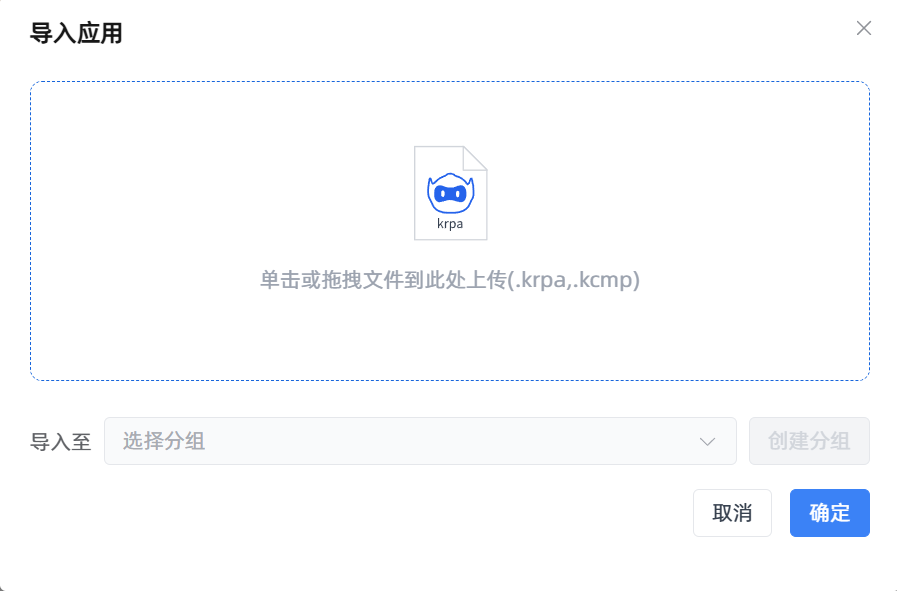
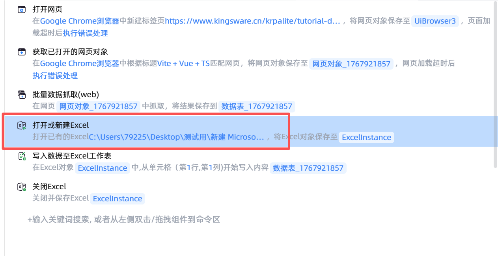
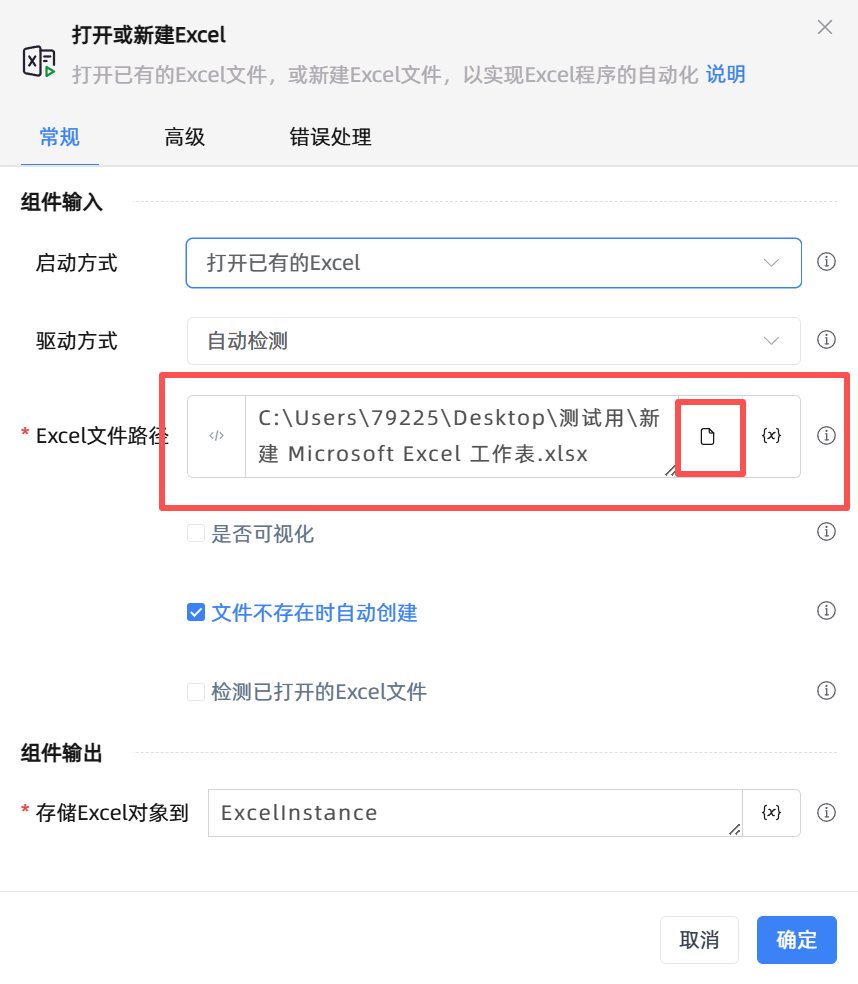
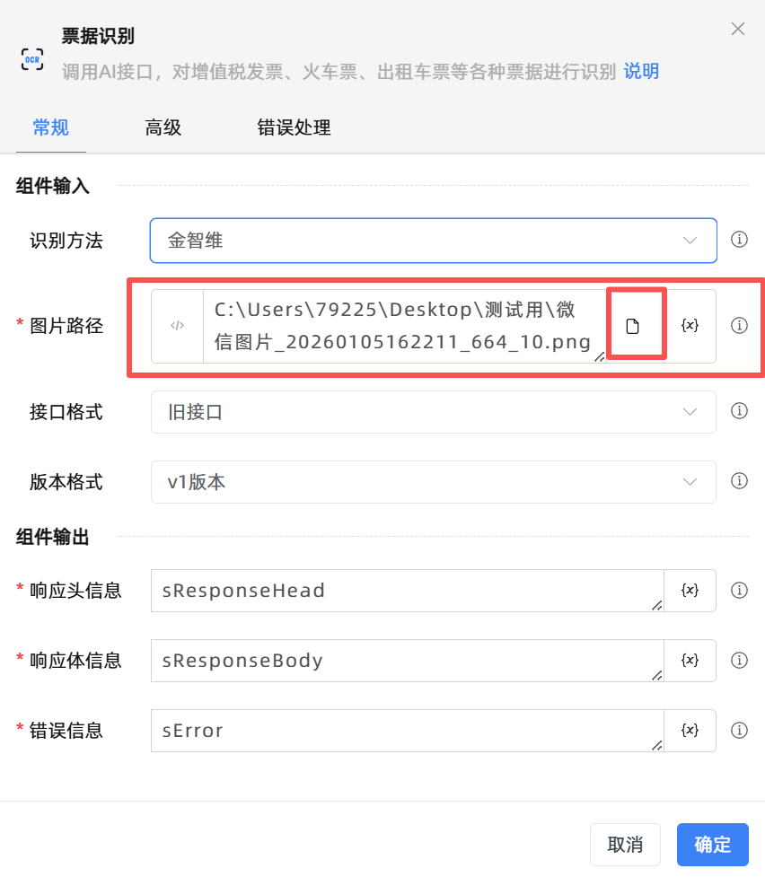

# 准备操作
   - 下载示例应用脚本 以及测试票据图片 并导入脚本  
    1. [点击下载示例脚本](https://download.krpalite.com:56780/Example/Poc操作示例.zip)  
    2. 解压下载的压缩包  
    3. 在lite首页 点击导入按钮
      
    4. 选择解压出来的脚本文件 POC操作示例.krpa
      
  ##  注意点
  - 数据抓取并写入excel流程需要修改‘打开或新建Excel’组件中的excel路径
    
    

  - 票据识别流程需要修改‘票据识别’组件中的票据图片路径
    
    